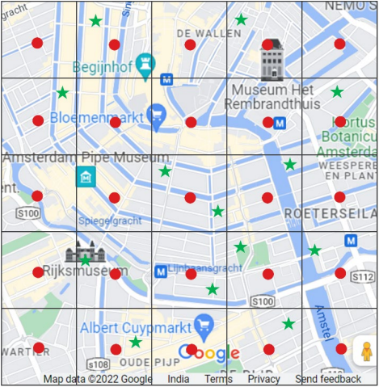

# Shellby Ltd.
Our solution for the [Shell.ai hackathon](https://www.hackerearth.com/challenges/competitive/shellai-hackathon-2022/)


## Problem Statement

The task was to optimise an electric vehicle (EV) charging network, so it remains robust to demographic changes and meets customer demand.



In this problem we were given a grid of 64x64 blocks. Total EV charging demand of each block is represented at the centre of the block and is called **demand point**. All demand points of a geographic region collectively create a *demand map* over the region of interest.

The charging of the EVs takes place at public parking locations that are predefined and have a fixed number of parking slots. These locations are called **supply points**. Typically, two types of charging station are installed based on their supply capacity:
- slow charging station (SCS)
- fast charging station (FCS)

All supply points of a geographic 
region collectively create a *supply map* over a region.

---

Using the demand map, supply map, demand-supply constraints and objective, we can optimally choose to place the EV charging stations so that the designed EV infrastructure is best suited to cater the forecasted demand.


## Pipeline for result generation
The pipeline to produce a valid submission file is:

### 1. Generate chargers and distribution (Run genetic algorithm)
```
python generator.py 2019 -g {generations} -p {population}
python generator.py 2020 -g {generations} -p {population}
```
This will generate 4 files in the *outputs/* directory
- chargers_2019.csv
- chargers_2020.csv
- ds_2019.npy
- ds_2020.npy

### 2. Create the submission file
```
python submit.py
```
Creates a submission.csv file in the *outputs/* directory

### 3. Validate the submission file
```
python validate.py outputs/submission.csv
```
