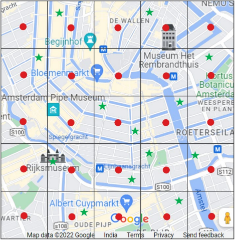

# Shellby Ltd.
Our solution for the [Shell.ai hackathon](https://www.hackerearth.com/challenges/competitive/shellai-hackathon-2022/)


## Problem Statement

The task was to optimise an electric vehicle (EV) charging network, so it remains robust to demographic changes and meets customer demand.



In this problem we were given a grid of 64x64 blocks. Total EV charging demand of each block is represented at the centre of the block and is called **demand point**. All demand points of a geographic region collectively create a *demand map* over the region of interest.

The charging of the EVs takes place at public parking locations that are predefined and have a fixed number of parking slots. These locations are called **supply points**. Typically, two types of charging station are installed based on their supply capacity:
- slow charging station (SCS)
- fast charging station (FCS)

All supply points of a geographic 
region collectively create a *supply map* over a region.

---

Using the demand map, supply map, demand-supply constraints and objective, we can optimally choose to place the EV charging stations so that the designed EV infrastructure is best suited to cater the forecasted demand.

## Solution

### Demand Predictions
Given the demand values for each block of the grid for the years 2010-2018 we had to make predictions for the demand values of 2019 and 2020.

The forecast of the demand points was made by taking into account an ensemble of the predictions made by the *Facebook's NeuralProphet* library and *sklearn LinearRegression* module.

The parameters of the weighted summation were produced by the *scipy's minimize* module, which is used to minimize the mean absolute error between the true and the predicted demand values. Afterwards, we predicted the demand for the years 2019 and 2020. We used several timeseries forecasting methods (SARIMAX, Polynomial Regression, Prophet, LightGBM) but the above approach, gave us the best results.


### Demand-Supply matrix generation
The Demand-Supply matrix is a 4096x100 matrix in which each DS<sub>ij</sub> element indicates how much demand of the i<sup>th</sup> demand point is satisfied by the j<sup>th</sup> supply point.

To fill this matrix we tried the following stategies:
1. **scipy.optimize**: Using boundaries and constraints to comply with the restrictions given and an objective function based on how far the customers have to travel to satisfy their EV charging demand. This failed because of the size of the matrix.
1. **Supply-first satisfaction**: A greedy approach where each supply point satisfies its nearest demand points until the available supply runs out.
1. **Demand-first satisfaction**: A greedy approach where the demand points with the highest demand are satisfied by their nearest available supply point.

The best strategy was number 3 beacuse it minimized the travel time of the highest-valued demand points.

### Implementation of Genetic Algorithm
The main challenge was to find an optimal distribution of supply chargers that minimized the overall cost. For that we decided to use a genetic algorithm.


#### 1. Population initialization
The following function randomly generates valid EV Charger distributions in the available Parking lots of the supply points.

`
offspring_generator(prob: float) -> dict[int, tuple[int, int]]
`
#### 2. Parent Selection based on their fitness
The following methods have been used for parent selection:
* Roulette Wheel Selection
* Elitism Selection
* Tournament Selection

#### 3. Crossover parents to reproduce
For crossover implementation we used a variety of methods, but mainly the following ones:
* One-point crossover
* Two-point and k-point crossover
* Uniform crossover

#### 4. Offspring Mutation
Since the charger distribution is limited by many contraints, a very simple mutate method has been applied. A random number of supply points have been selected and their chargers have been re-assigned again in a random, but still valid way.

#### 5. Offspring evaluation
Finally offspring evaluation takes place and merging with the main population follows. 

### Pipeline for result generation
The pipeline to produce a valid submission file is:

#### 1. Generate chargers and distribution (Run genetic algorithm)
```
python generator.py 2019 -g {generations} -p {population}
python generator.py 2020 -g {generations} -p {population}
```
This will generate 4 files in the *outputs/* directory
- chargers_2019.csv
- chargers_2020.csv
- ds_2019.npy
- ds_2020.npy

#### 2. Create the submission file
```
python submit.py
```
Creates a submission.csv file in the *outputs/* directory

#### 3. Validate the submission file
```
python validate.py outputs/submission.csv
```

## The Team
<a href = "https://github.com/xanthoko/Shell-AI/graphs/contributors">
  
</a>
